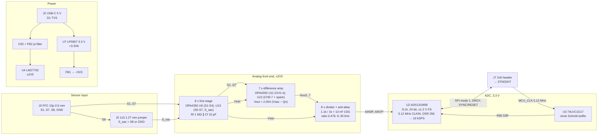

# PVDF e-skin acquisition board: design document

KiCad 10 project `PCB/` ("PCB v2", root sheet title "TESI COSMIC"), branch `riccardo_fix`.

This document explains what the board does, how each part of it was dimensioned, and why the layout looks the way it does. It is written for the thesis reviewer and for whoever builds, debugs or extends the board.

## How to read this document

**State documented.**
- Schematic: `FOGLIO1.kicad_sch` as saved 2026-09-29 11:24, and `FOGLIO2.kicad_sch` as saved 2026-09-28 15:40 (local time).
- Board: `PCB v2.kicad_pcb` with mtime 2026-09-29 14:28 (local time). This is the working copy: commit `7197caf` plus an uncommitted silkscreen pass.
- A second silkscreen pass (J7 pin labels, per-channel labels in the dense blocks) was being made while this document was written. Section 5.10 describes the silkscreen as it was at the mtime above.

**Sources, in order of authority.**
1. Schematic and board files.
2. `PCB/CHANGELOG-2026-09-28-ADC-swap.md` (Parts 1–8).
3. `PCB/bom/BOM_Mouser_2026-09-28.csv`.
4. Git history (`main..riccardo_fix`).
5. The design-session transcripts, which hold most of the reasoning.

Where they disagree, the files win. Section 11 lists every disagreement found.

**Markers.**
- **(unverified)**: a number or behaviour I could not check against the files, or a datasheet value quoted in the design sessions that I did not re-check against the datasheet.
- **(estimate)**: a value I computed from part values.

---

## 1. Purpose and system overview

The board digitises the output of a PVDF (polyvinylidene fluoride) piezoelectric e-skin.

**Inputs.**
- Up to eight sensor electrodes arrive on a 10-way 0.5 mm FFC connector (J3).
- Seven of them (S1–S7) are measurement channels.
- The eighth sensor line (S8) can be routed by a jumper (J5) to a *reference* ("sacrificial") charge amplifier.

**Signal chain.**
1. Each sensor has its own first-stage amplifier: 1 MΩ ∥ 15 pF feedback. The sheet calls it a charge amplifier; in the signal band it works as a transimpedance amplifier (Section 2.2).
2. A difference amplifier subtracts the reference channel from each measurement channel.
3. A divider plus RC filter scales each result to the ADC range.
4. The ADC is a TI ADS131M08: 8 channels, 24-bit, simultaneous-sampling ΔΣ.
5. The ADC talks to an STM32H7 MCU board over SPI through a 2×6 header (J7). The MCU also supplies the ADC master clock.

**Power.** The board runs from a single 5 V USB-C (power-only) input. The analog rails are ±2.5 V from an LM27762 charge-pump inverter with two built-in LDOs. The ADC has its own 3.3 V LDO.



**Key figures** (computed from part values unless marked):

| Quantity | Value |
|---|---|
| Channels | 7 measurement + 1 reference (Vsac), all digitised simultaneously |
| First-stage feedback | 1 MΩ ∥ 15 pF, corner 10.6 kHz. Transimpedance of 1 V/µA below the corner. |
| Difference-amp gain | 10 k / 4.99 k = 2.004 |
| Divider ratio | 1.0 / 2.1 = 0.476; 0.4755 with the ADC's 330 kΩ input impedance (unverified) |
| End-to-end transimpedance (in band) | 2.004 × 1 MΩ × 0.4755 ≈ **0.953 V per µA** of (i_n − i_sac) at the ADC pin |
| Anti-alias corner | 1 / (2π · 523.8 Ω · 10 nF) = **30.4 kHz** |
| ADC | ±1.2 V full scale (gain 1, internal 1.2 V reference). 10 kSPS at OSR 256 with a 5.12 MHz clock. Digital-filter bandwidth about 2.6 kHz (unverified). |
| Supplies | 5 V USB-C in; ±2.5 V analog; +3.3VA (ADC AVDD); +3V3 (ADC DVDD and logic) |
| Board | 56 × 45 mm, 4 layers, 1.6 mm, M2 holes on a 50 × 39 mm pattern |
| Parts | 132 footprints; 124 parts to order, plus 1 shunt |

---

## 2. Signal chain

### 2.1 Channel map and part assignment

The quad op-amps were re-assigned (CHANGELOG Part 2) so that the two packages next to J3, U6 and U13, hold all eight first stages. The difference amplifiers sit in U11 and U12.

| Sensor (J3 pin) | 1st stage (section, −IN / OUT pins) | Rf / Cf | Stage-1 net | Diff amp (section) | Rin (Qn→DnN) / Rfb (DnN→Vout) / Rp (Vsac→DnP) / Rg (DnP→GND) | Output | Divider (top / bottom / cap) | ADC input |
|---|---|---|---|---|---|---|---|---|
| S1 (2) | U6-A, 2 / 1 | R22 / C10 | Q1 | U11-A | R23 / R24 / R25 / R26 | Vout1 | R61 / R62 / C48 | **AIN0** (pin 29) |
| S2 (3) | U6-B, 6 / 7 | R27 / C12 | Q2 | U11-B | R28 / R29 / R30 / R31 | Vout2 | R65 / R66 / C50 | **AIN2** (pin 1) |
| S3 (4) | U6-C, 11 / 10 | R37 / C14 | Q3 | U11-C | R40 / R39 / R35 / R36 | Vout3 | R67 / R68 / C51 | **AIN3** (pin 4) |
| S4 (5) | U6-D, 15 / 16 | R32 / C13 | Q4 | U11-D | R41 / R38 / R33 / R34 | Vout4 | R63 / R64 / C49 | **AIN1** (pin 32) |
| S5 (6) | U13-C, 11 / 10 | R47 / C16 | Q5 | U12-A | R50 / R49 / R45 / R46 | Vout5 | R69 / R70 / C52 | **AIN4** (pin 5) |
| S6 (7) | U13-D, 15 / 16 | R42 / C15 | Q6 | U12-B | R51 / R48 / R43 / R44 | Vout6 | R71 / R72 / C53 | **AIN5** (pin 8) |
| S7 (8) | U13-A, 2 / 1 | R57 / C18 | Q7 | U12-C | R60 / R59 / R55 / R56 | Vout7 | R73 / R74 / C54 | **AIN6** (pin 9) |
| S_sac (J5.2; S8 = J3 pin 9 via J5) | U13-B, 6 / 7 | R10 / C8 | **Vsac** | feeds all seven Rp | — | — | R75 / R76 / C55 | **AIN7** (pin 12) |
| — | — | — | — | U12-D spare | follower: +IN (14) = GND, −IN (15) = OUT (16) = `SPARE_D` | — | — | — |

- All +IN pins of the first stages (U6 pins 3, 5, 12, 14; U13 pins 3, 5, 12, 14) are tied to GND.
- The mapping was checked pad by pad against the board file.
- AIN1–AIN3 are deliberately out of order. The PCB routing sets this order (Section 5.6, decision D-19), and the firmware must use a lookup table (Section 10).

### 2.2 Stage 1: sensor amplifier (U6, U13)

**Topology.** Inverting amplifier. The sensor connects to −IN; +IN is at GND; Rf = 1 MΩ ∥ Cf = 15 pF is in the feedback path.

**Corner frequency.** f_c = 1 / (2π · 1 MΩ · 15 pF) = **10.6 kHz**.

**Operating regime.** The tactile band (0.1 Hz to a few kHz) lies far below 10.6 kHz. In band the stage therefore behaves as a **transimpedance amplifier**:

  Q_n ≈ −R_f · i_n = −R_f · dQ_sensor/dt

For a PVDF film, dQ/dt is proportional to dF/dt. The output therefore follows the *rate of change* of force, not the force itself. Only above 10.6 kHz does the stage behave as a charge amplifier (Q_n = −Q/C_f).

**This regime is intentional.**
- The designer confirmed it on 2026-09-28: "we are working under the pole, at flat band, as a transimpedance amplifier".
- The values were kept.
- The sheet heading still reads "CHARGE AMPLIFIERS (Vout = −Q/Cf above f = 1/(2·π·Rf·Cf))", because the thesis reviewer prefers that wording (the heading was reverted at their request).
- If a force-proportional signal is wanted, integrate digitally in firmware (Section 10.6), or change Rf/Cf in a future revision (GΩ-range Rf or much larger Cf). Both options were raised in the sessions and not pursued.

**Parts.**
- Rf: KOA RN73R 1 MΩ, 0.1 %, 25 ppm thin film. Thin film was chosen for low excess noise where it matters.
- Cf: Samsung CL10C150JB8NNNC, 15 pF C0G ±5 %. Every Murata 0603 15 pF C0G part is NRND.
- The eight first stages, including S_sac, use identical parts and an identical Rf/Cf placement and fan-out (U13's copper is a copy of U6's). The sensor trace lengths are not equal: about 11–27 mm, all on F.Cu inside the guard (Section 5.5). Common-mode pickup can only cancel in the subtraction if the sensor channel and the reference channel see the same thing.

**Op-amp.** OPA4350EA (quad, rail-to-rail, CMOS input, SSOP-16).
- Datasheet values quoted in the sessions **(unverified)**: GBW about 38 MHz, minimum supply 2.7 V, input bias current ≤ 10 pA, PSRR about 40 µV/V.
- The bias current contributes at most 10 pA × 1 MΩ = 10 µV of offset.

### 2.3 Stage 2: difference amplifier (U11, U12)

**Topology.** Classic four-resistor difference amplifier.
- Q_n → 4.99 kΩ → −IN, with 10 kΩ from −IN to the output.
- Vsac → 4.99 kΩ → +IN, with 10 kΩ from +IN to GND.

**Transfer function.**

  Vout_n = (10 k / 4.99 k) · (Vsac − Q_n) = **2.004 · (Vsac − Q_n)**

Below the stage-1 pole this becomes Vout_n ≈ 2.004 · R_f · (i_n − i_sac). The sheet writes it as "Vout = 2 × (Vsac − Qn) (subtracts the sacrificial sensor)".

**Resistor value.** The values were originally 5 k / 10 k. The 5 k became 4.99 k (commit `f8d2adf`), because an exact 5.00 k part only exists at about €1.7. The same 4.99 k / 10 k pair is used on both halves of every amplifier, so the ratio stays matched.

**Resistor type.** Yageo RT0603BRD, 0.1 %, 25 ppm.

**CMRR.** The worst-case CMRR set by the resistors is about (1 + G) / (4 · tol) = 3.004 / 0.004 ≈ 750, i.e. **about 57 dB (estimate)**; typical parts do better. The sessions quote "roughly 60 dB".

**Loading.**
- **Q_n** sees about 5 kΩ into a virtual node, which the OPA4350 drives easily.
- **Vsac** (U13 pin 7) drives seven +IN legs of 14.99 kΩ each, plus the AIN7 divider of 2.1 kΩ. In total that is **1.06 kΩ (estimate)**, about **2.3 mA** at 2.45 V.
- The Vsac bus is tapped at C8 pin 2, the far end of U13-B's feedback network, not at pin 7. The trace IR drop therefore stays inside the feedback loop (decision D-21).
- About 70 mm of 0.1 mm copper is about 0.3 Ω, which gives under 0.5 mV (0.02 %) of error between taps. That is small compared with the resistor-limited CMRR.

**Spare section.** U12-D is tied as a follower with +IN at GND. The old U13-D had floating inputs.

### 2.4 Divider and anti-alias filter (R61–R76, C48–C55)

Each channel is built the same way:

```
Vout_n / Vsac ── R_top 1.1 k ──┬───────────── AINnP  (U2)
                               │
                          R_bot 1.0 k   C_AA 10 nF C0G
                               │           │
GND ───────────────────────────┴───────────┴── AINnN (tied to GND at U2: pseudo-differential)
```

**Ratio.**
- 1.0 / 2.1 = **0.476**.
- Including the ADC input impedance of about 330 kΩ at gain 1–4 (unverified): (1 k ∥ 330 k) / (1.1 k + 1 k ∥ 330 k) = **0.4755**, a fixed −0.15 % gain error that calibrates out.

**Range mapping.** The op-amp's practical swing of about ±2.45 V on ±2.5 V rails maps to **±1.165 V**, just inside the ADS131M08's ±1.2 V full scale (97 %).
- Even a saturated op-amp therefore cannot push the ADC input past about ±1.2 V. That is within the ADS131M08's input limit of about AGND − 1.3 V (unverified).
- No clamps are needed. This is the main reason the divider was chosen over lowering the diff-amp gain (decision D-4).

**Anti-alias filter.**
- Thevenin source resistance: 1.1 k ∥ 1 k = **523.8 Ω**.
- With 10 nF: **f_c = 30.4 kHz**.
- In-band droop at 2.6 kHz: 0.03 dB.
- With a 5.12 MHz CLKIN, the modulator samples at f_MOD = f_CLKIN / 2 = **2.56 MHz**. That is where aliasing would come from. There the RC gives 20·log10(2560 / 30.4) ≈ **38.5 dB (estimate)** of attenuation, on top of the modulator's oversampling.
- The session figure of "−43 dB at 4.096 MHz" assumed the standard 8.192 MHz clock and does not apply to the chosen 5.12 MHz clock.

**Parts.**
- C_AA: Murata GRM1885C1H103JA01D, C0G. TI §11.1 says to use C0G on the analog inputs, because the capacitor absorbs the sampling charge kicks.
- R_top: Yageo RT0603BRD071K1L. R_bot: KOA RN73R1JTTD1001B25. Both 0.1 %.
- The sessions judged 1 % adequate, since divider mismatch only changes each channel's gain, not the Vsac cancellation, which happens upstream. The 0.1 % parts were picked in the procurement pass so that channels match without calibration.

**Loading.** Each divider adds about 2.1 kΩ to its op-amp's output, in parallel with the 10 k feedback: about 1.2 mA at full swing.

**Added noise.** The divider adds about 2.9 nV/√Hz (from the session), negligible next to the 1 MΩ resistors.

**CH7 = Vsac.** The reference channel is digitised too, for diagnostics: firmware can check how well the subtraction works, and the raw reference is available for the thesis data. The alternative, S8 digitised un-amplified, was rejected.

### 2.5 ADC (U2, ADS131M08IPBSR, TQFP-32)

| Pin(s) | Function | Connection |
|---|---|---|
| 29 / 32 / 1 / 4 / 5 / 8 / 9 / 12 | AIN0P…AIN7P | Divider outputs (see 2.1) |
| 30, 31, 2, 3, 6, 7, 10, 11 | AIN0N…AIN7N | GND (pseudo-differential) |
| 13, 27, 28 | AGND (27/28 are AGND per the KiCad symbol) | GND |
| 25 | DGND | GND |
| 14 | REFIN | C59 100 nF to GND. The internal 1.2 V reference is used; 100 nF on REFIN is TI's characterisation condition. |
| 15 | AVDD | +3.3VA, C37 1 µF |
| 26 | DVDD | +3V3, C36 1 µF |
| 24 | CAP | C35 220 nF (required when DVDD > 2.7 V, TI §10.1) |
| 23 | XTAL1/CLKIN | R80 33 Ω ← U3 output |
| 22 | XTAL2 | Not connected. Firmware must set `XTAL_DIS = 1`. |
| 16 | SYNC/RESET (active low) | ADC_SYNC_RESET, R78 10 k pull-up |
| 17 | CS (active low) | ADC_CS, R77 10 k pull-up |
| 18 | DRDY (active low) | R82 33 Ω → ADC_DRDY |
| 19 | SCLK | ADC_SCLK |
| 20 | DOUT | R81 33 Ω → ADC_MISO |
| 21 | DIN | ADC_MOSI |

**Why the ADS131M08 replaced the AD7606** (decision D-1).
- The AD7606 needs AVCC 4.75–5.25 V, which raw USB VBUS cannot guarantee and which leaves no room for an LDO.
- None of the AD7606-family parts or pin-compatible clones run on 3.3 V.
- The ADS131M08 runs on 3.3 V and accepts inputs below ground without a negative rail.
- It samples 8 channels simultaneously at 24 bits, comes in a hand-solderable TQFP-32, and costs about a fifth as much. The BOM has €7.23 at qty 10, against about €45 for the AD7606 at qty 1 on Mouser.
- Rejected alternatives:
  - AD7770/AD7779: LFCSP-64, and inputs cannot go below ground on a single 3.3 V supply.
  - Two MAX11040K: more expensive than the AD7606.

**Performance at OSR 256, gain 1 (datasheet values quoted in the sessions, unverified).**
- Noise about 10.7 µVrms, about 17.8 effective bits.
- The sinc3 digital filter is about −3 dB at 0.262 · f_DATA ≈ 2.6 kHz.

### 2.6 End-to-end scaling

| Point | Value at ADC full scale (±1.2 V) | Value at op-amp clip (±2.45 V) |
|---|---|---|
| AINnP | ±1.200 V | ±1.165 V |
| Vout_n | ±2.52 V, not reachable: the op-amp clips first | ±2.45 V |
| Vsac − Q_n | — | ±1.22 V |
| i_n − i_sac (in band, below 10.6 kHz) | — | ±1.22 µA |

**LSB size.**

| Word length | At the ADC pin | Vout | Vsac − Q_n | Current |
|---|---|---|---|---|
| 24-bit | 2.4 V / 2^24 = 143 nV | 301 nV | 150 nV | 0.15 pA of differential sensor current |
| 16-bit | 36.6 µV | 77 µV | 38 µV | 38 pA |

**Code to physical units** (24-bit, gain 1): see Section 10.5.

**Expected signal amplitude: open question.** A session estimate (unverified) put a PVDF sensor with d33 ≈ 25 pC/N under 1 N at 10 Hz at about 1.6 nA, i.e. about 1.6 mV at the stage-1 output. That would use only about 0.1 % of the range.
- The ADS131M08's PGA (gain 1–128, set in firmware) can then trade full scale for resolution without any hardware change.
- The designer has not yet supplied a measured amplitude, and the gains are deliberately untouched until then.

### 2.7 Noise budget (estimate)

**Scope.** Resistor thermal noise and ADC noise only. Op-amp voltage noise multiplied by the noise gain (1 + jωR_f·C_sensor) is **not included**: the sensor capacitance is not documented in the repository. For a sensor of about 1 nF, a session estimate put the noise gain at about 6 at 1 kHz.

| Source | Density | Over about 2.6 kHz | At the ADC pin |
|---|---|---|---|
| Rf 1 MΩ thermal, one channel | √(4kTR) = 129 nV/√Hz | 6.6 µVrms at Q_n | — |
| Channel + reference Rf, through the diff amp (×2.004, uncorrelated, ×√2) | — | 18.7 µVrms at Vout | 8.9 µVrms |
| Divider (523.8 Ω) | 2.9 nV/√Hz | 0.15 µVrms | negligible |
| ADS131M08, OSR 256, gain 1 (unverified) | — | — | 10.7 µVrms |
| **Total (lower bound)** | | | **≈ 14 µVrms** |

- The reference channel's noise is **common to all seven channels**, because it is subtracted from each of them. It appears as a correlated component, visible directly on AIN7.
- Leakage into a −IN node shifts the output by 2.5 V · 1 MΩ / R_leak: 25 µV at 10¹¹ Ω, 25 mV at 100 MΩ (dirty, humid board). Wash off flux after hand soldering.

### 2.8 Crosstalk considerations

Two different mechanisms were analysed in the sessions (2026-09-29).

**1. Coupling *onto* a low-impedance node (Q_n, Vout_n, Vsac).**
- These are op-amp outputs, with closed-loop output impedance well below 1 Ω at kHz.
- A stray 1 pF is about 160 kΩ at 1 MHz, so aggressor noise is attenuated by roughly 70–100 dB.
- Vias (about 1 nH, 0.5 pF) and reference-plane changes are irrelevant at these frequencies.
- This is why Q and Vout routes are allowed to change layer and run on B.Cu.

**2. Coupling *into* a stage-1 virtual ground (−IN pin or sensor trace).**
- Here the source's low impedance does **not** help.
- The injected charge flows through Rf ∥ Cf exactly like sensor charge. The error depends only on the coupling capacitance Cc:
  - below 10.6 kHz: error = **ωCcRf**;
  - above 10.6 kHz: error = **Cc / Cf**.
- With guard copper between the Q traces and the pin rows, Cc is estimated at a few fF:

| Cc | 1 kHz | 5 kHz | Ceiling above 10.6 kHz |
|---|---|---|---|
| 5 fF (realistic, shielded) | −90 dB | −76 dB | −70 dB |
| 20 fF (pessimistic, no shield) | −78 dB | −64 dB | −58 dB |

- These are unsimulated estimates. They are far below the mechanical crosstalk between neighbouring sensors through the skin itself.
- **Layout rule that follows:** never run a node that swings volts (Q or Vout) parallel to, and unshielded from, another channel's −IN pin or sensor trace for several mm. At that point Cc reaches tenths of a pF and the table moves up by 30–40 dB.
- Two sensor traces next to each other are harmless: both are virtual grounds and neither moves.
- Where Q2/Q3 pass their own section's −IN pin, the stray capacitance simply adds to that channel's 15 pF Cf: under 0.05 % gain change.

**Divider block.** An AIN node is 524 Ω ∥ 10 nF. Tens of fF of coupling from a passing Vout is below −120 dB at 5 kHz (estimate).

---

## 3. Power architecture and decoupling

### 3.1 Power tree

```
J2 USB-C VBUS (+5V) ──┬── D1 SMF5.0A TVS to GND (at J2)
                      ├── C62 22 µF 16 V X5R 0805        (pi filter, connector side)
                      ├── R7 4.7 k ── D2 green LED       (power indicator)
                      ├── TP1
                      ├── U7 LP5907MFX-3.3 (IN, EN) ── +3.3VA ──┬── U2 AVDD (C37 1 µF), C61 1 µF
                      │    C60 1 µF in                          └── FB1 BLM18PG221SN1 ── +3V3 ── U2 DVDD (C36 1 µF),
                      │                                                                          U3 VCC (C58 100 nF),
                      │                                                                          R77/R78 pull-ups
                      └── FB2 BLM18KG102SN1 ── +5V_CP ── C34 10 µF + C33 100 nF ── U4 LM27762 VIN
                                                                                     ├── OUT+ = +2V5 (C20 4.7 µF, C9 100 nF, TP2)
                                                                                     ├── OUT− = −2V5 (C19 4.7 µF, C7 100 nF, TP3)
                                                                                     ├── CP ≈ −5 V node (C17 10 µF)
                                                                                     └── C+/C− flying cap C6 1 µF
```

The board has **one** power input: 5 V from USB-C. There is no ±5 V input.
- The only negative 5 V on the board is the LM27762's internal charge-pump output (net `Net-(U4-CP)`, C17). It exists only inside the power section.
- A "−5V" silkscreen text left over from an earlier design was removed on 2026-09-29.

### 3.2 USB-C input (J2, U1, R3/R4, D1)

- **J2:** GCT USB4125-GF-A, a 6-pin power-only receptacle.
- **CC lines:** 5.1 kΩ pull-downs (R3, R4) mark the board as a sink. U1 (TPD2E2U06DCKR) protects the CC lines against ESD.
- **D1 SMF5.0A** (Littelfuse; 5.0 V standoff; V_BR ≥ 6.4 V; V_C ≤ 9.2 V at 21.7 A; 200 W) sits at the VBUS pins. It tames hot-plug ringing.
  - It was chosen over TI TVS0500 because it starts conducting about 1.5 V earlier (6.4 V vs 7.5 V minimum), which is what matters for low-energy ringing. It is also cheap and hand-solderable.
  - **Neither TVS keeps VBUS below the LM27762's 5.8 V absolute maximum during a hard surge.** An OVP load switch (e.g. TPD1S514 family) was proposed as the real fix and not added.

### 3.3 Pi filter (C62, FB2, C34/C33)

**Target.** The LM27762 switches at about 2 MHz (1.7–2.3 MHz, unverified datasheet range). The filter keeps that ripple off VBUS, and so off U7's input and the USB cable, and keeps host noise out of U4. It was designed with Murata SimSurfing for the 0.15–10 MHz band.

**Parts.**
- **FB2:** BLM18KG102SN1D: 1000 Ω at 100 MHz, 1 A, 0.2 Ω max. At about 170 mA it drops ≤ 34 mV.
  - Its DC resistance damps the bead–capacitor resonance. The session estimates Q ≈ 1–1.5, somewhere around 15–40 kHz (unverified).
- **C62:** 22 µF 16 V X5R 0805 (GRM219R61C226ME15K).
  - The 6.3 V 47 µF parts SimSurfing first suggested were rejected: too little voltage margin, heavy DC-bias derating, and too much capacitance on VBUS.
  - The original 0603 ZRB part was out of stock, so the footprint became 0805.
- **U4 side:** the second capacitor is the existing C34 (10 µF) + C33 (100 nF), placed at U4 as its datasheet requires. C21 was removed to cut VBUS bulk capacitance.

**Placement rule.** U7, the LED and TP1 are fed from the **connector side** of FB2 (net `+5V`). U4 is fed from `+5V_CP`.

**VBUS bulk capacitance** is about 33 µF nominal (C62 + C34 + C60 + C33), less after DC-bias derating. That is above the 10 µF USB attach guideline quoted in the sessions. Most hosts tolerate it (unverified).

### 3.4 Analog rails: LM27762 (U4, WSON-12)

**What it is.** An inverting charge pump followed by a positive and a negative LDO.

**Enables and PGOOD.**
- EN+ and EN− are tied together (pins 8 and 12) and pulled up by R12 10 k to +5V_CP, so the part is always on.
- PGOOD (pin 1) is pulled up by R11 10 k and **not used**. It is not brought to J7.

**Feedback dividers.**
- **+2V5:** V_OUT+ = 1.2 V · (1 + R1 / R6) = 1.2 · (1 + 130 k / 120 k) = **+2.50 V**.
- **−2V5:** V_OUT− = −1.22 V · (1 + R2 / R9) = −1.22 · (1 + 105 k / 100 k) = **−2.50 V**. The −1.22 V FB− reference is quoted from the session's datasheet reading (unverified).
- R2 is AC0603FR-07105KL, because the RC-series 105 k had no stock.

**Capacitors.**
- C6 1 µF flying capacitor.
- C17 10 µF 25 V on the CP node (about −5 V).
- C19/C20 4.7 µF 16 V X5R plus C7/C9 100 nF on the outputs. The BOM notes to check DC-bias derating on C19/C20.

**Why ±2.5 V rather than ±1.5 V** (decision D-5).
- ±1.2 V rails are impossible: below the LM27762's ±1.5 V minimum and the OPA4350's 2.7 V minimum supply span.
- ±1.5 V would work, but costs about 4.5 dB of stage-1 headroom (PVDF produces large spikes on impact) and more LM27762 dissipation (about 0.6 W vs 0.4 W, estimate).

**Earlier history.** The first design used an LT3483 inductor-based inverter with LT1761-2.5 and LT1964 LDOs (old `distinta PCB v3-TESI.xlsx`, `PCB v2.csv`). Commit `d215e9c` replaced them with the single LM27762.

### 3.5 ADC supply: U7 LP5907MFX-3.3, FB1

- **Supply path:** U7 runs from +5V (connector side of FB2), with EN tied to IN and pin 4 NC.
  - 1.7 V of headroom lets the LDO reject low-frequency USB noise. A passive filter cannot do that below about 10 kHz.
  - The original choice was TPS7A2033PDBVR. It was out of stock with a 26-week lead, so the part became LP5907MFX-3.3/NOPB, which has the same SOT-23-5 pinout and footprint.
  - The LP5907's VIN maximum is 5.5 V, against 6.0 V for the TPS7A20. The TPS7A20's "92 dB PSRR at 1 kHz" figure in the old sheet note does **not** apply to the LP5907. Its PSRR has not been checked for this document.
- **AVDD and DVDD split:** U7 output = **+3.3VA** → U2 AVDD. **FB1** (BLM18PG221SN1D, 220 Ω at 100 MHz) → **+3V3** → U2 DVDD, U3, and the R77/R78 pull-ups. The bead keeps digital switching current off AVDD.
- **Decoupling:** C60 1 µF on the input; C61 1 µF on the output (≥ 1 µF required). C37/C36 1 µF on AVDD/DVDD (TI §10.3).

### 3.6 Op-amp decoupling

Each quad has 100 nF on +2V5 and 100 nF on −2V5, placed on **B.Cu directly under the package**:

| Quad | +2V5 | −2V5 |
|---|---|---|
| U6 | C22 | C11 |
| U13 | C27 | C28 |
| U11 | C23 | C24 |
| U12 | C25 | C26 |

- The +2V5 pads reach the In2 plane through about 0.1 mm of prepreg.
- The −2V5 pads connect straight into the B.Cu −2V5 pour.
- The GND pads use vias to In1.
- Bulk capacitance for the rails is at U4 (C19/C20).
- In2 (+2V5) and the B.Cu −2V5 pour face each other across the 0.1 mm prepreg over most of the board. That forms roughly 1 nF of distributed rail-to-rail capacitance (estimate: 2520 mm², εr 4.5, 0.1 mm).

### 3.7 Power budget (estimate)

| Load | Current |
|---|---|
| 16 OPA4350 amplifiers at about 5.2 mA each (unverified) | about 83 mA per rail |
| LM27762 input | about 170 mA (session estimate) |
| Output loads at full swing: 7 dividers + Vsac bus | a few mA more |
| ADS131M08 + U3 + pull-ups via U7 | a few mA (unverified) |
| D2 LED: (5 V − V_f) / 4.7 k | about 0.4–0.6 mA, dim (V_f not verified) |
| **Total from USB** | **about 0.2 A** |

---

## 4. ADC configuration, clocking and digital interface

### 4.1 Clock

```
STM32H7 MCO2 (PC9), 5.12 MHz ── [33 Ω at H7, recommended] ── J7 pin 2 (MCU_CLK)
      ── R79 100 k pull-down ── U3 74LVC1G17 Schmitt buffer (IN pin 2, OUT pin 4, +3V3, C58 100 nF)
      ── R80 33 Ω (source termination, at U3) ── U2 pin 23 CLKIN          (XTAL2 not connected)
```

**Why the MCU supplies the clock** (decision D-6).
- TI (§8.3.5) asks for the modulator clock to be synchronous with SCLK for best performance.
- Deriving both MCO2 and the SPI kernel clock from the same H7 PLL makes them frequency-locked.
- The alternatives were discussed and rejected:
  - **A bare crystal** cannot be shared with other logic.
  - **A 2-flip-flop SCLK synchroniser** adds latency that caps SCLK at about 1–1.5 MHz, and adds digital activity next to the ADC.
  - **A local 5.12 MHz XO** was hard to source.

**Why 5.12 MHz.**
- Data rate = f_CLKIN / (2 · OSR). With OSR = 256, 5.12 MHz gives exactly **10 kSPS**. The standard 8.192 MHz clock gives 8 or 16 kSPS.
- 5.12 MHz is inside the 0.3–8.4 MHz range for high-resolution mode (unverified).

**Clock hardening.**
- The Schmitt buffer removes false edges picked up in the cable. False edges, not jitter, are the real risk: at 2 kHz, 1 ns of jitter still allows about 98 dB SNR.
- R80 damps ringing on the 3 mm run from U3 to CLKIN.
- R79 keeps the buffer input defined when J7 is unplugged.
- The clock needs a 40–60 % duty cycle. Generate it with an **even** MCO divider (e.g. PLL2_P = 40.96 MHz ÷ 8, unverified against the H7 reference manual).

### 4.2 SPI and control lines

| Signal | Direction (board view) | On-board conditioning |
|---|---|---|
| ADC_SCLK | in | none; F.Cu 0.1 mm |
| ADC_MOSI (DIN) | in | none |
| ADC_MISO (DOUT) | out | R81 33 Ω source termination next to U2 |
| ADC_CS | in | R77 10 k pull-up to +3V3 (deasserted when unplugged) |
| ADC_DRDY | out | R82 33 Ω source termination next to U2 |
| ADC_SYNC_RESET | in | R78 10 k pull-up to +3V3 |
| MCU_CLK | in | R79 100 k pull-down, U3 buffer, R80 |

- Logic levels are 3.3 V.
- The sheet note asks for 33 Ω series resistors **at the H7 end** on MCU_CLK, SCLK, MOSI and CS. These belong on the MCU board.
- **SPI mode 1** (CPOL 0, CPHA 1). A full 10-word frame (status + 8 channels + CRC) must be read on each DRDY falling edge. See Section 10 for the SCLK-rate problem.

### 4.3 J7 pinout (after the re-pin, CHANGELOG Part 8)

J7: Würth 61001221121, 2×6 2.54 mm SMT header (footprint `PinHeader_2x06_P2.54mm_Vertical_SMD`). **Wire the MCU side to this table.**

| Pin | Signal | | Pin | Signal |
|---|---|---|---|---|
| 1 | ADC_SYNC_RESET | | 2 | MCU_CLK (5.12 MHz in) |
| 3 | GND | | 4 | ADC_MOSI (→ U2 DIN) |
| 5 | ADC_CS | | 6 | GND |
| 7 | GND | | 8 | ADC_MISO (← U2 DOUT via R81) |
| 9 | ADC_DRDY (← U2 via R82) | | 10 | ADC_SCLK |
| 11 | GND | | 12 | GND |

- **Five GND pins.** In a ribbon cable, MCU_CLK (pin 2) has GND (pin 3) as a neighbour. Its other neighbour, pin 1, is SYNC_RESET, which rarely switches.
- **No supply pin.** The board is powered only from USB-C, and the H7 board powers itself. The two share GND through J7 (and through the USB hosts, if both are on the same PC). See Section 9 on ground loops and power sequencing.
- **Why the re-pin.** The digital lines enter U2 from its right side, top to bottom: CLKIN, DIN, DOUT, SCLK, DRDY, CS, SYNC. The old order made the F.Cu fan-out cross itself. The new order lets DIN, MISO, SCLK, DRDY and CS run up the right board edge and enter the 1.9 mm gap between J7's pad rows in arrival order, with no crossings. SYNC enters pad 1 from the side, and CLK stays on pin 2 directly above U3.

---

## 5. PCB

### 5.1 Board outline and mechanics

- **Outline** (Edge.Cuts): 121.26–177.26 × 76.04–121.04 mm, i.e. **56.0 × 45.0 mm**, with 1 mm corner radii.
  - The top edge line runs from (122.26, 76.040) to (176.26, 76.060). It is tilted by 0.02 mm, a cosmetic drafting imperfection.
- **Mounting holes:** four M2 plated holes, `MountingHole_2.2mm_M2_DIN965_Pad`, with the pads on GND. They sit at (124, 79), (174, 79), (124, 118) and (174, 118), a **50 × 39 mm** pattern.
  - The Cmts.User dimensions give 3.26 mm from hole centre to the right edge and 2.94 mm to the top edge.
- **Components on both sides:** 91 footprints on F.Cu, 41 on B.Cu.
  - The B.Cu parts are all the difference-amp resistors, the op-amp decoupling, R3/R4/R11/R12 and U1.

### 5.2 Stackup

From the board's `setup/stackup` section:

| Layer | Type | Thickness | Use |
|---|---|---|---|
| F.Mask | solder mask | 0.01 | |
| **F.Cu** | copper | 0.035 | All signals: sensor inputs, AIN, SPI, most analog |
| dielectric 1 | prepreg FR4, εr 4.5, tan δ 0.02 | **0.10** | |
| **In1.Cu** | copper | 0.035 | **Solid GND plane** (whole board) |
| dielectric 2 | core FR4, εr 4.5 | 1.24 | |
| **In2.Cu** | copper | 0.035 | **+2V5 plane** (whole board, 0.5 mm clearance) |
| dielectric 3 | prepreg FR4, εr 4.5 | 0.10 | |
| **B.Cu** | copper | 0.035 | **−2V5 pour**, plus B.Cu parts and a few routes |
| B.Mask | solder mask | 0.01 | |
| **Total** | | **1.60 mm** | Copper finish "None" and `dielectric_constraints no` in the file |

**Rationale.**
- **F.Cu sits 0.1 mm above a solid GND plane.** GND is also the +IN potential of every first stage.
  - A −IN pad or sensor trace on F.Cu is capacitively coupled only to its own reference. That is harmless, and acts like a free guard.
  - Digital return currents flow in In1 directly under each trace.
  - A 0.1 mm trace over 0.1 mm of εr 4.5 is about 59 Ω and about 0.10 pF/mm (session estimate).
- **B.Cu references In2 (+2V5), 0.1 mm away.** Anything on B.Cu couples to a supply rail fed by the charge pump. That drives three rules:
  1. sensor inputs and stage-1 feedback parts stay on F.Cu;
  2. fast digital lines stay on F.Cu, so their return current does not flow in the analog +2V5 plane;
  3. B.Cu is used only for low-impedance or DC nets.
- **The 0.1 mm outer prepreg is essential to the design.** The guard, return-path and crosstalk arguments all depend on it. It must be ordered explicitly: a fab's default 4-layer stackup may use a thicker prepreg. Also specify a copper finish (Section 9).

### 5.3 Copper zones

| Zone | Layer | Net | Extent / notes |
|---|---|---|---|
| (unnamed) | In1.Cu | GND | Whole board, priority 2, thermal gap 0.5 / spoke 0.5, fillet 3 mm |
| (unnamed) | In2.Cu | +2V5 | Whole board, clearance 0.5 mm |
| (unnamed) | B.Cu | −2V5 | Whole board, priority 1 |
| `GND_AFE_GUARD` | F.Cu | GND | x 124.6–136.6, y 86.6–120.4. Covers J3, U6, U13, J5 and all sensor traces. **Solid pad connection**, islands removed, priority 1. Stitched to In1 by about 31 vias (0.6/0.3) plus 6 small vias (0.25/0.15) along J3. |
| `5VUSB`, `5V_USB` | F.Cu | +5V | J2 → D1/C62/FB2/U7 area |
| `5VIN` | F.Cu | +5V_CP | FB2 → C34/C33/U4 VIN |
| `C+`, `C−`, `+2v5`, `−2v5` | F.Cu | U4 nodes | Tight pours around U4's flying-cap and output pins |
| `GND`, `GND_1` … `GND_5` | F.Cu | GND | Local GND islands at the U4 / J2 capacitors |
| `GND_SUPPLY_F` | F.Cu + B.Cu | GND | J2 area (clearance 0.25) |

- There is **no separate AGND/DGND**: one GND net, and In1 is unbroken.
- The ADC's AGND and DGND pins, the AINxN pins and the analog front end all return to In1.
- The digital lines are confined to the right-hand strip, so their return currents stay there.

### 5.4 Design rules (`PCB v2.kicad_pro`)

| Rule | Value |
|---|---|
| Net classes | **Only `Default`**: clearance 0.2, track 0.2, via 0.6 / 0.3 drill. Other widths were set per route. |
| Board minimum clearance | 0.1. The effective clearance is 0.2, because every net is in Default. |
| Minimum track width | 0.1 |
| Copper to edge | 0.2 |
| Hole clearance / hole to hole | 0.25 / 0.25 |
| Minimum via diameter / minimum through-hole drill / minimum annular ring | 0.25 / 0.15 / 0.05 |
| Microvia (not used) | 0.2 / 0.1 |
| Minimum text height / thickness | 0.8 / 0.08 |
| Predefined track widths | 0.1, 0.2, 0.6 |
| Predefined via | 0.25 / 0.15 |
| No `.kicad_dru` custom rules | |

**Track widths actually used** (from the board file):

| Net group | Width | Layers |
|---|---|---|
| Sensor inputs S1–S7, S_sac, S8 | **0.1 mm** runs, with short 0.2 mm pad fan-outs; 0.5 mm-radius arcs at corners | F.Cu only, no vias |
| Q1–Q7 | 0.2 mm fan-out, 0.1 mm runs; exactly one via each | F.Cu, with B.Cu for Q4 |
| D1N…D7P (diff-amp inputs) | 0.2 | F.Cu / B.Cu, one fan-out via each |
| Vout1–7 | 0.1–0.2 | F.Cu; Vout2/6/7 loop on B.Cu |
| Vsac bus | 0.1 (plus 0.2 at the fan-out) | F.Cu + B.Cu trunk, 4 vias |
| AIN0P–AIN7P | 0.1 | F.Cu only |
| SPI, DRDY, CS | 0.1 | F.Cu only |
| ADC_SYNC_RESET | 0.1 | F.Cu + B.Cu (barely switches), 2 vias |
| MCU_CLK, CLKIN, CAP, REFIN | 0.15 | F.Cu |
| ±2V5 | 0.2–0.6 (−2V5 up to 0.5/0.6) | F.Cu, plus planes |
| +5V / +5V_CP | 0.6 main feeds (plus zones); 0.1 for U7 IN/EN and the pull-ups | |
| +3.3VA | 0.15–0.6 | F.Cu + B.Cu |
| +3V3 | 0.2–0.3 | F.Cu + B.Cu |

**Vias.**
- 214 in total:
  - **205 × 0.6 / 0.3**;
  - **6 × 0.25 / 0.15** (GND stitching at J3's left edge);
  - **3 × 0.3 / 0.2** (U4 EN+ / PGOOD).
- 144 of the vias are GND.

**Why 0.1 mm signal tracks.** The designer asked for them "if it works out with our signal integrity". At kHz, and with SPI edges over a 0.1 mm-deep ground, width does not matter for signal integrity. The narrow tracks let routes pass **between IC pin rows on F.Cu** (the U6/U13 centre channels for Q2, Q3 and Q5–Q7), avoiding extra layer changes.

**Corners.** Filleted or rounded throughout: 62 arcs in the file. The sensor traces use 0.5 mm arcs; the designer filleted the SPI and Vsac routes in pcbnew. The designer wanted them for cleanliness. At these frequencies they have no measurable signal-integrity effect, as the session noted.

### 5.5 Placement strategy

Board coordinates are in mm; y grows downwards.

| Area | Parts | Reasoning |
|---|---|---|
| Top-left, board edge | J2 (134.9, 79.4), D1, C62, FB2, U1, R3/R4, D2/R7 | Input protection at the connector: D1 and C62 right at the VBUS pins, with a short, fat GND |
| Top-centre | U4 (151.1, 85.0) with C6/C17/C19/C20/C7/C9/R1/R2/R6/R9/C33/C34; U7 (140.6, 89.4) with C60/C61 | Compact switched-capacitor loop with local F.Cu pours. U7 on the connector side of FB2. |
| Left edge | J3 (124.0, 103.3) FFC; TP1/TP2/TP3/TP5 (x ≈ 123.5–125.0, y 83.8–97.9) | Sensor entry; test points at the edge for probing |
| Left-centre | U6 (132.3, 95.1) above J3's centre; U13 (132.9, 110.6) below; J5 (125.85, 112.0) | **All eight first stages next to J3.** The high-impedance sensor nets stay inside the F.Cu GND guard. Measured copper per net, including the Rf/Cf-to-pin stubs: S3 10.9, S6 10.6, S5 12.8, S4 13.2, S_sac 17.1, S7 23.4, S2 24.9, S1 27.1 mm. S1/S2 and S7 go around the outside of their op-amp. Rf/Cf sit on F.Cu right at each section's adjacent −IN/OUT pads (within about 2 mm). |
| Centre | U11 (148.9, 97.7) and U12 (148.9, 108.4) on F.Cu; their 28 resistors plus C23–C26 on B.Cu under each chip | The low-impedance stage can live on the bottom. U11's right half mirrors its left; U12 copies U11. |
| Centre-right | Divider block, two staggered columns: A at x 156.08 (AIN0/2/4/6), B at x 159.28 (AIN1/3/5/7); group pitch 4.7 mm, B offset by 2.35 mm | Eight 3.9 mm groups in one column would need about 35 mm; only about 28 mm is free. The stagger lets every column-B Vout pass through a column-A gap between two GND pads, and every column-A AIN leave through a column-B gap. The groups run AIN0→7 top to bottom, so the fan-in to U2 has no crossings. |
| Right | U2 (166.13, 102.10); C35/C36 at its top-right corner; C37/C59 at its bottom-right; R81/R82 staggered right of it | Decoupling at the pins. R81/R82 stagger to open a lane for SCLK. |
| Right, above U2 | J7 (165.03, 87.18), rotated −90 | MCU header |
| Right, between J7 and U2 | U3 (172.75, 97.9), R79, C58, R80 | Buffer halfway between J7 pin 2 and CLKIN, so the post-buffer run is about 3 mm. Everything stays at x ≤ 174.55, leaving the right-edge strip for the digital lines. |
| Bottom-right | FB1, R77, R78 | Supply split and pull-ups |

**Why the stage-2 resistors went on the bottom but Rf/Cf did not** (decision D-12). A session study found:
- Stage-1 −IN copper on B.Cu would couple about 0.8–1 pF to +2V5. That bypasses 45–65 dB of the op-amp's PSRR, differs per channel, and so is not cancelled by the Vsac subtraction.
- The stage-2 nodes are 3.3–10 kΩ, where such strays are irrelevant.
- In the old layout, S2/S4/S6 each ran 10.7–12.5 mm on B.Cu. That problem is gone.

### 5.6 Routing

**Sensor inputs (S1–S7, S8, S_sac).**
- F.Cu only, 0.1 mm, **no vias, no crossings**, all inside `GND_AFE_GUARD`.
- Each trace enters its node at the Rf/Cf pad, never directly at the op-amp pin.
- S1/S2 run up the left of U6 and over the top. S3–S6 use the corridor between U6 and U13. S7 runs down the left of U13 and under it.
- S8 leaves J3 pin 9 between S7 and J3 pin 10 (GND) and drops to J5 pin 3.
- S_sac cannot reach U13 pin 6 without crossing S7's loop on F.Cu. It goes **around** the loop (below y 117.65), rather than hopping through the B.Cu −2V5 pour with two vias on a sensor input. The guard was extended to y 120.4 to cover it.

**Q1–Q7 (stage-1 outputs → diff-amp input resistors on B.Cu).** Every Q net has exactly one via.
- **Q1:** F.Cu to a via-in-pad at R23.
- **Q2, Q3:** boxed in on the outside of U6 (S1/S2 run over U6, S3/S4 come up from below). They leave through **U6's centre channel**:
  - Q2 at y 94.54, Q3 at y 95.68, either side of the two centre GND vias.
  - Guard copper fills between each trace and the pin rows.
  - Both stay on F.Cu all the way. Q2 turns down at x 139.9. Q3 turns down at x 138.9 and runs under U11's body at y 103.1.
  - Each ends in a via-in-pad down to its B.Cu input resistor: R28 for Q2, R40 for Q3.
- **Q4:** has to cross Q1. It leaves the guard on F.Cu, vias down at (137.5, 99.64), and runs on B.Cu at y 93.0 above U11's resistor row into R41.
- **Q5–Q7:** run through **U13's centre channel** to vias at R50, R51 and R60.

**Why these layer changes are acceptable** (designer's question on 2026-09-29):
- The coupling *onto* Q is soaked up by its sub-ohm output impedance.
- The coupling *into* another channel's −IN is set by Cc alone, kept to a few fF by the guard strips (Section 2.8).
- Rotating U11 was considered. It cannot remove a crossing, because the cyclic order of the destinations (Q1 top-left → Q4 top-right → Q3 bottom-right → Q2 bottom-left) survives any rotation. U11 was left as it was.

**Vout1–7 → dividers.**
- Vout1, Vout3, Vout4 and Vout5 stay on F.Cu with no extra via.
- Vout2 runs on B.Cu along y 102.9 to a via-in-pad at R65.
- Vout6 and Vout7 take nested B.Cu loops under U12 and come up through vias at (154.4, 105.56) and (154.3, 107.91).
- These are low-impedance outputs below the In1 plane, so the loops are harmless.
- **The order in which the Vouts can reach the divider column (Vout1, Vout4, Vout2, Vout3, …) is what set the AIN1–3 channel rotation.** Keeping the schematic order would have cost 3–4 extra vias and a 0.65 mm squeeze across an AIN line.

**Vsac bus.**
- Tap at C8 pin 2.
- F.Cu along y 116.7, out of the guard along the bottom strip to x 153.5, then into R75 (AIN7) along the reserved corridor at y 110.26.
- B.Cu trunk at x 141.5 with branches to R25, R30, R45 and R43.
- R33 via a B.Cu branch at y 103.7. R35 via an F.Cu hop (two vias). R55 via an F.Cu spur and a via.
- A first all-B.Cu version closed copper rings around U11's and U12's resistor groups. That **cut the −2V5 pour feeding C24/C26**, i.e. the op-amps' V− supply. It was found by DRC and branch-by-branch trials, and replaced with the F.Cu hops.

**AIN fan-in.**
- F.Cu, 0.1 mm, no crossings.
- AIN0/1 go to U2's top pins, AIN2–5 to the left side, AIN6/7 to the bottom.
- There is about 2.3 mm between column B and U2's left pins.

**Digital.**
- All SPI lines are on **F.Cu over In1**, 0.1 mm.
- They fan out from U2's right pins, go up the right edge at x 174.9–176.5 (0.4 mm pitch), and run through J7's row gap (0.3 mm pitch) into pads 4, 8, 10, 5 and 9.
- SYNC_RESET: F.Cu to R78, then B.Cu around the bottom and up the right edge, then F.Cu into pad 1. It is allowed on B.Cu because it barely switches.
- The lines stay ≥ 5 mm from any AIN trace.
- Session estimate of worst-case crosstalk between adjacent SPI lines: a few percent, about 20–50 mV of glitch against a CMOS threshold of about 1 V.

**Supplies.**
- +3.3VA: from U7 it drops to B.Cu at x 152.5 (0.4 mm), runs along y 91 and under U2 at x 164.8, then comes up beside C37.
- +3V3: FB1 → R77/R78, then B.Cu up x 174.5 to U3/C58, and along y 96.1 to C36.
- DC nets on B.Cu are harmless and keep F.Cu free for the digital fan-out.

### 5.7 Grounding and return paths

**Single solid GND plane on In1.** Every GND pad in the analog section has its own direct via to In1:
- The 16 divider-block GND pads, mostly via-in-pad.
- Diff-amp Rg legs: via-in-pad on R26, R31, R44, R46 and R56.
- R62/R34 and R66/R36 share a via, which connects the F.Cu divider pad to the B.Cu diff-amp pad directly beneath it.
- U13 pins 5 and 12 (grounded +IN) each have their own via. These also land on the C27/C28 GND pads.
- J7 GND pins 3, 6, 7, 11 and 12 each have a via. Pin 11's via sits to the left of the pad because of the +2V5 via row.

**U2.**
- All 12 GND pins, including the AINxN pseudo-differential negatives, have inward stubs to a GND bar inside the pad ring.
- Two vias under the body connect the bar to In1.

**Digital return currents.**
- These flow in In1 directly under the F.Cu SPI traces, inside the right-hand strip and J7's row gap, away from the analog front end.
- This is the reason SPI is **not** routed on B.Cu: there the return path would be the +2V5 analog plane.

**Charge-pump loop.** Kept local to U4 with small F.Cu pours and GND islands. FB2 isolates it from VBUS.

### 5.8 Crosstalk mitigation (summary)

1. All eight first stages sit next to J3, so the high-impedance traces are short.
2. Sensor traces are on F.Cu only, over GND, inside a solid-connected F.Cu GND guard stitched to In1.
3. Q and Vout traces stay outside the guard, or are separated from −IN pins by guard strips (the U6/U13 centre channels).
4. All eight first-stage channels, including S_sac, have identical parts, Rf/Cf placement and layer (F.Cu, no vias), so common-mode pickup largely cancels in the subtraction. Sensor trace lengths still differ (about 11–27 mm).
5. The digital lines are confined to the right edge strip, ≥ 5 mm from AIN traces, with source terminations (R80/R81/R82) at the drivers.
6. The divider block has a GND pad on either side of each passing Vout.
7. The charge pump is isolated by FB2 and by distance: it sits at top-centre, well away from the AFE and the divider block.

### 5.9 Via-in-pad

About 60 vias sit inside SMD pads:
- GND in the divider block and in the diff-amp Rg legs;
- decoupling caps under the op-amps;
- Q, D and Vout nets at the B.Cu resistors.

**Why it is acceptable.** The designer accepted it on 2026-09-29: "I am going to manually solder anyway so not an issue". Via-in-pad was needed because the divider block is packed on purpose, and every gap between its pads carries an AIN or Vout trace.

**If the board is ever assembled by reflow,** order filled-and-capped vias (VIPPO), or expect solder to wick into the 0.3 mm holes.

### 5.10 Silkscreen and assembly aids

**State as of 2026-09-29, after the silkscreen pass.**
- **Footprint references:** 0.8 mm high with a 0.15 mm stroke. Each one is placed next to its own part, closer to that part than to any other, and clear of pads, vias and the board edge. The mounting holes H1–H4 are hidden.
- **Dense blocks:** the 56 references in the dense blocks are 0.5 mm high with a 0.12 mm stroke. There is not enough room for 0.8 mm text there. The blocks are:
  - the divider/anti-alias block: R61–R76 and C48–C55;
  - the diff-amp resistors under U11/U12: R23–R26, R28–R31, R33–R36, R38–R41, R43–R46, R48–R51, R55, R56, R59 and R60;
  - the diff-amp decoupling capacitors C23–C26.
- **Divider block labels (front):** each reference sits on its part's own row. Labels for the left column (AIN0/2/4/6) run down the left side, and labels for the right column (AIN1/3/5/7) down the right side.
  - A few labels sit over the solder-mask-covered ring of a tented via, but never over the drill. Vias are tented on both sides.
- **Per-channel labels (0.8 mm):**
  - **CH1–CH7** on B.SilkS, one next to each diff-amp resistor group.
  - **AIN0–AIN7** on B.SilkS, directly behind each divider C / Rs / Rsh triple. The front has no room for 0.8 mm text between the two 3.2 mm-pitch columns.
  - The channel map is AIN0=Vout1, AIN1=Vout4, AIN2=Vout2, AIN3=Vout3, AIN4=Vout5, AIN5=Vout6, AIN6=Vout7, AIN7=Vsac (Section 10).
- **J7 pin names (0.8 mm):** these replace the old AD7606-era texts (Vdrive, CONVST, SPI_MISO, SPI_CS, SPI_SCK, BUSY, RESET).
  - Odd row, above the pads: SYNC, GND, CS, GND, DRDY, GND (pins 1, 3, …, 11).
  - Even row, below the pads: CLK, MOSI, GND, MISO, SCLK, GND (pins 2, 4, …, 12).
  - CLK and the pin-12 GND are horizontal because a via or R79 sits directly below those pads.
  - The C35, C36, C58, R79 and U2 references were moved to make room.
- **User texts:** 7 `gr_text` items at 0.5 mm, all in the knockout style.
  - Test-point labels: +2V5 (TP2), +5V (TP1), −2V5 (TP3), GND (TP5).
  - J5 pin labels: GND (pin 1), S_SAC (pin 2), S8 (pin 3).
- **DRC text_height:** the rule minimum is 0.8 mm, so the 0.5 mm references and user texts show up as DRC `text_height` warnings (63 in total). They are intentional. Lower *Board Setup → Text & Graphics → minimum text height* to 0.5 mm to clear them. No new silkscreen overlap or silk-over-copper items were introduced.
- **Assembly aid:** before assembly, regenerate the InteractiveHtmlBom (`bom/ibom.html`) from the current board. The copy in the repo is from 2026-09-16 and predates the ADC swap.

### 5.11 DRC and ERC status

I did not run DRC or ERC for this document: kicad-cli rewrites the project file. The last recorded results are below.

**DRC** (commit `7197caf` message and session notes):
- **0 unconnected items.**
- No clearance, short, courtyard (except below) or hole violations.
- Remaining items are cosmetic or library-related:
  - silk_over_copper and silk_overlap: from the old user texts and the pre-existing R37/U6 and U13/R47 overlaps;
  - text_height: the 0.5 mm texts;
  - about 21 starved thermals: the small power zones use 0.2 mm gap / 1.0 mm spoke thermals;
  - footprint-library mismatches;
  - the **C48/J7 courtyard overlap**.

**ERC:** 0 errors, 31 warnings.
- Library-configuration warnings: the `Opa4` footprint library and J3's custom library are not in a project library table (none exists in `PCB/`).
- `C_Small` symbol-copy warnings.
- The `S8` local/global label warning.

---

## 6. Connector pinouts

### J2: USB-C power input (GCT USB4125-GF-A, 6P, top-mount horizontal)

| Pin | Net |
|---|---|
| A9, B9 | +5V (VBUS) |
| A12, B12, SH (×4) | GND |
| A5 | CC1: 5.1 k to GND (R4) + U1 ESD |
| B5 | CC2: 5.1 k to GND (R3) + U1 ESD |

### J3: sensor FFC (Würth 687110182122, 10-way, 0.5 mm pitch)

| Pin | Net | Pin | Net |
|---|---|---|---|
| 1 | GND | 6 | S5 → U13-C |
| 2 | S1 → U6-A | 7 | S6 → U13-D |
| 3 | S2 → U6-B | 8 | S7 → U13-A |
| 4 | S3 → U6-C | 9 | S8 → J5 pin 3 |
| 5 | S4 → U6-D | 10 | GND |
| Z1, Z2 (tabs) | GND | | |

- The custom footprint matches Würth's land pattern (BOM audit).
- The mating FFC (0.3 mm thick) is not in the BOM.

### J5: reference-sensor select (Harwin M50-3630342, 1×3, 1.27 mm SMT; shunt Harwin M50-2000005)

| Pin | Net |
|---|---|
| 1 | GND |
| 2 | S_sac (U13-B −IN, via R10/C8) |
| 3 | S8 (J3 pin 9) |

| Shunt position | Effect |
|---|---|
| **2–3** | The 8th FFC electrode drives the reference amplifier. Normal operation: Vout_n = 2·(Vsac − Q_n). |
| **1–2** | S_sac is grounded, so Vsac ≈ 0 (op-amp offset only) and Vout_n ≈ −2·Q_n. The subtraction is disabled. Useful for bring-up and for measuring the benefit of the reference. |
| open | S_sac floats on 1 MΩ ∥ 15 pF, so Vsac picks up whatever couples to it. Avoid. |

- J5 moved from 2.54 to 1.27 mm pitch so it fits next to U13 inside the guard.
- The part has no pin-1 mark. A 180° turn only swaps pins 1 and 3, so either orientation fits.
- **Do not order M50-3530342**: that is the through-hole version.

### J7: MCU header

See Section 4.3.

### Test points (bare 1.5 mm pads, no part to fit)

| TP | Net | Position |
|---|---|---|
| TP1 | +5V | (123.75, 97.90) |
| TP2 | +2V5 | (123.53, 94.17) |
| TP3 | −2V5 | (125.01, 83.77) |
| TP5 | GND | (125.01, 87.52) |

There is no TP4, and no test point for +3.3VA, +3V3, the clock or DRDY. Probe those on C61/C37, C36/C58, R80 and R82.

---

## 7. BOM notes and ordering caveats

**File:** `bom/BOM_Mouser_2026-09-28.csv`, CRLF line endings.
- 36 lines, 125 items per board: 124 PCB parts plus the J5 shunt.
- The priced lines come to about **€49 per board at qty 10**. D2, J2, J3, J5, the shunt, J7 and U1 are unpriced.

**Audit (session, 2026-09-29).** The schematic, board and BOM agree: 124 orderable parts, one row each, MPN and manufacturer matching, no DNP. The C0G parts are C0G, the voltage ratings suit their rails, and the packages match their footprints.

**Before ordering:**
1. **OPA4350 (U6, U11–U13).** The BOM note says "END OF LIFE (TI Last Time Buy)". That is only half right:
   - **OPA4350EA/250** (small reel) is LTB;
   - **OPA4350EA/2K5** is the same die in the same SSOP-16 and is **active**.
   - Buy /250 now with spares, or order /2K5 as cut tape. No footprint change is needed.
   - Beware the Mouser search URL `q=OPA4350EA/250`: the unescaped slash can land on the /2K5 listing.
2. **Mouser links are search URLs** (`/c/?q=`), except the two Harwin rows. For D1 (SMF5.0A, several makers), pick the **Littelfuse** listing.
3. **Stock not verified:** D2, J2, J3, J7 and U1 are "not checked"; J5 and the shunt are "not verified"; several resistors are only "in stock". Mouser blocked automated reads, so check by hand.
4. **No spares:** the quantities are per board. Add roughly +10 per 0603 value, +1–2 per IC and connector, spare shunts, and spare OPA4350s.
5. **Footprint text:** R77–R79 are listed with `PCM_SparkFun-Resistor:R_0603_1608Metric`, while the schematic uses `Resistor_SMD:R_0603_1608Metric`. Both are 0603, so only the text is wrong.
6. **Test points:** TP1/2/3/5 are `in_bom yes` in the schematic but correctly absent from the CSV, since they are bare pads. A fresh KiCad BOM export would list them. Mark them Exclude-from-BOM.
7. **C62:** the GRM219R61C226ME15**K** suffix is the 330 mm reel; the **L** suffix is the same capacitor on a 180 mm reel. Cut tape is fine.
8. **J7:** Würth 61001221121's recommended land is 2.3 × 1.0 mm on an 8.5 mm span. The board has 3.15 × 1.0 mm at ±2.525 mm. The 7.5 mm tail span still lands on the pads, so this is acceptable.
9. **Mating parts are not in the BOM:** the FFC for J3 and the cable or socket for J7.
10. **Stale files in `PCB/` that must not be used for ordering:**
    - `PCB v2.csv` and `distinta PCB v3-TESI.xlsx`: AD7606/LT3483-era BOMs;
    - `bom/ibom.html` (2026-09-16);
    - all `PCB v2-*.gbr` and `PCB v2-job.gbrjob` (2026-09-16, before the ADC swap and the whole AFE re-layout).
    - Regenerate the fabrication outputs from the current board.

**Part-selection notes.**
- **Thin film 0.1 %/25 ppm** (KOA RN73R, Yageo RT0603BRD) for every resistor in the signal path: Rf, the diff-amp pairs and the dividers.
- **Thick film 1 %** (Yageo RC0603FR-07) elsewhere.
- **Capacitor MPNs** were replaced where the previous part was obsolete or unorderable (100 nF, 1 µF, 4.7 µF).

---

## 8. Design decisions log

| # | Decision | Alternatives considered | Rationale |
|---|---|---|---|
| D-1 | ADC: TI ADS131M08 (U2) replaces AD7606 | AD7606 family and clones (5 V only); AD7770/71/79 (LFCSP-64, no below-ground input on 3.3 V); 2× MAX11040K (costlier) | Runs on 3.3 V behind an LDO, native below-ground inputs, 8 simultaneous 24-bit channels, TQFP-32, about 1/5 the cost |
| D-2 | Internal 1.2 V reference, 100 nF on REFIN; AINxN tied to GND (pseudo-differential) | External reference; fully differential inputs | Fewer parts; single-ended AFE outputs |
| D-3 | 8th ADC channel digitises Vsac | S8 un-amplified; leave unused | Lets the firmware check the subtraction; the reference is recorded for the thesis |
| D-4 | Scale ±2.45 V → ±1.17 V with a 1.1 k / 1 k divider after the diff amp | Lower the diff-amp gain to about 0.96 (op-amp could still drive the ADC past its absolute limit on overload, needing clamps); ±1.5 V rails | The divider physically limits the ADC input; keeps stage-1 headroom; its Thevenin R doubles as the anti-alias R |
| D-5 | Keep ±2.5 V analog rails (LM27762) | ±1.2 V (impossible); ±1.5 V (−4.5 dB headroom, more heat) | PVDF impact spikes need headroom |
| D-6 | ADC clock from the STM32H7 MCO2, Schmitt-buffered on board | Bare crystal; local XO (8.192 MHz common, 5.12 MHz hard to find); XO shared with the MCU; 2FF SCLK synchroniser | TI wants CLKIN synchronous with SCLK; the H7 PLL gives both. The synchroniser would cap SCLK and add noise. |
| D-7 | 5.12 MHz CLKIN, OSR 256 → exactly 10 kSPS | 8.192 MHz → 8 / 16 kSPS | Required rate of 10 kSPS on all 8 channels |
| D-8 | U3 74LVC1G17 + R80 33 Ω at the buffer, R79 100 k pull-down | Direct CLKIN from the header | Removes false edges from the cable; defined input when unplugged; source termination at the driver (TI §11.1) |
| D-9 | R81/R82 33 Ω source terminations on DOUT/DRDY next to U2; R77/R78 10 k pull-ups on CS and SYNC/RESET | None | Softer edges on the cable; ADC stays deselected and out of reset when J7 is unplugged |
| D-10 | Op-amp section swap: U6/U13 (next to J3) hold all 8 first stages; U11/U12 the 7 diff amps | Original mixed assignment, with S3–S6 routed about 28 mm to U11/U12 | Short high-impedance traces; lets the sensor routing be planar |
| D-11 | Spare U12-D tied as a follower with +IN at GND | Leave floating (the old U13-D) | An unused section with floating inputs can oscillate and draw current |
| D-12 | Rf/Cf on F.Cu at the pins; stage-2 resistors and op-amp decoupling on B.Cu | All passives on the bottom, so the op-amps sit closer to J3 | B.Cu references +2V5: about 1 pF to a supply would bypass the op-amp PSRR per channel. Stage-2 nodes are low impedance. |
| D-13 | Sensor traces on F.Cu only, no vias, all 8 channels identical; enter at the Rf/Cf pad | Allow B.Cu excursions (as the old S2/S4/S6 did) | Keeps the −IN nodes referenced to GND (= +IN) and matched, so the reference subtraction cancels pickup |
| D-14 | F.Cu `GND_AFE_GUARD` pour with solid pad connection, stitched to In1 | No guard; guard ring only | Fills gaps between Q traces and pin rows (Cc down to a few fF); shields S_sac; low-impedance GND for the +IN pins |
| D-15 | 0.1 mm signal tracks | 0.2 mm default | Routes can pass between IC pin rows on F.Cu; SI is unaffected at these frequencies |
| D-16 | Q2–Q4 (and Q1, Q5–Q7) each take one via to B.Cu diff-amp resistors | Rotate U11; swap sections B↔D; keep everything on F.Cu | Rotation cannot remove the crossings (cyclic order). The Q nodes are low impedance, so the layer change is harmless. |
| D-17 | Keep "CHARGE AMPLIFIERS" wording on the sheet; values 1 MΩ ∥ 15 pF kept | Retitle as transimpedance; change Rf/Cf for a true charge-amp response | The reviewer prefers the wording. The designer confirmed that transimpedance operation below the 10.6 kHz pole is intended. |
| D-18 | Divider block in two staggered columns at 4.7 mm pitch, groups in AIN0→7 order | One column (would need about 35 mm; about 28 mm available) | Every Vout enters and every AIN leaves through a neighbour's gap, flanked by GND pads; planar fan-in to U2 |
| D-19 | **Rotate AIN1–AIN3** (AIN1 = Vout4, AIN2 = Vout2, AIN3 = Vout3) | Keep the schematic order | The Vouts can only leave U11 in one direction each, and arrive as 1, 4, 2, 3. The old order cost 3–4 vias and a 0.65 mm squeeze across an AIN line. The firmware does not exist yet, so the only cost is a lookup table. |
| D-20 | Vout2/6/7 loop on B.Cu | Extra F.Cu squeezes | Low-impedance outputs below the In1 plane |
| D-21 | Vsac bus tapped at C8 pin 2, not at U13 pin 7 | Tap at pin 7 | Same net, but the tap at the far end of the feedback network keeps the bus's IR drop inside the loop. It is also the side where the route leaves the guard. |
| D-22 | Vsac branches to R35/R55 as F.Cu hops | All-B.Cu tree | The B.Cu tree closed rings that isolated the −2V5 pour feeding C24/C26 (the op-amp V− supply) |
| D-23 | Via-in-pad for GND and fan-out in dense blocks | Vias beside pads (no room) | The board is hand-soldered, so wicking is not a concern |
| D-24 | J7 as a 2×6 with 5 GND pins, re-pinned to U2's pin order | Old 1×7 SMD header; first 2×6 order | Planar F.Cu fan-out; GND next to CLK |
| D-25 | SPI on F.Cu only (over In1 GND); SYNC_RESET and the 3.3 V supplies allowed on B.Cu | Route SPI on B.Cu | B.Cu returns would flow in the +2V5 analog plane. SYNC barely switches; supplies are DC. |
| D-26 | Separate low-noise 3.3 V LDO (U7) from +5V for the ADC; FB1 splits AVDD / DVDD | Passive filter on raw VBUS; ADC on the H7's 3.3 V | 1.7 V of headroom gives real rejection; keeps the MCU board's supply noise off this board |
| D-27 | U7 = LP5907MFX-3.3 | TPS7A2033PDBVR (26-week lead) | Same pinout and footprint, in stock. VIN max 5.5 V (vs 6.0 V) accepted. |
| D-28 | USB pi filter C62 22 µF + FB2 1 kΩ bead + C34/C33; U7 and the LED on the connector side; C21 removed | Bead only; RC; boost + LDO | Keeps the 2 MHz charge-pump ripple off VBUS and U7; bead DCR damps the resonance; less VBUS bulk capacitance |
| D-29 | D1 SMF5.0A TVS | TI TVS0500; OVP load switch (TPD1S514) | Conducts earlier on hot-plug ringing; cheap; hand-solderable. OVP noted but not added. |
| D-30 | Power: LM27762 charge pump + LDOs | LT3483 inductor inverter + LT1761 / LT1964 LDOs (original design) | Single part, no inductor (commit `d215e9c`) |
| D-31 | Diff-amp 5 k → 4.99 k | Exact 5.00 k at about €1.7 | Same ratio on both halves; gain 2.004 |
| D-32 | Thin-film 0.1 % resistors in the signal path, C0G for Cf and C_AA | 1 % thick film, X7R | Lower excess noise; matched channels; C0G linearity at the ADC input |
| D-33 | J5 at 1.27 mm pitch, Harwin M50-3630342 + M50-2000005 shunt | 2.54 mm (did not fit inside the guard next to U13) | Fits next to U13; the land pattern matches exactly |
| D-34 | S_sac routed around S7's loop on F.Cu | Two-via hop through the B.Cu −2V5 pour | No vias or layer change on a sensor input |
| D-35 | ADC position U2 at (166.13, 102.10), 0.6 mm left of the first spot | Original spot | Widens the right-hand strip to 7.0 mm for the digital lines |
| D-36 | Filleted / rounded corners | 45° / 90° corners | Designer preference; no SI effect at these speeds |
| D-37 | Silkscreen references at 0.8 mm; dense blocks hidden (per-channel labels in progress) | 1.0 mm everywhere; InteractiveHtmlBom only | 0.8 mm is the rule minimum; dense blocks cannot hold legible 0.8 mm text |
| D-38 | Keep the 0.1 % divider resistors | 1 % (the session found 1 % adequate) | Channel-to-channel gain match without calibration |

---

## 9. Known issues, open items, bring-up and test

### 9.1 Known issues and open items

**Blocking or important:**
1. **SPI rate vs data rate (firmware).** The designer plans a **1 MHz SCLK** (said on 2026-09-28 and 2026-09-29). The sheet note says **~8 MHz**. At 10 kSPS the 10-word frame does **not** fit at 1 MHz (Section 10.2). Decide before writing firmware.
2. **Stackup must be ordered explicitly.** The 0.1 mm F.Cu–In1 prepreg (and 0.1 mm In2–B.Cu) is central to the guard and return-path design.
   - Also confirm the fab supports the 0.25 / 0.15 mm vias with 0.05 mm annular ring, and the 0.1 mm tracks.
   - Set a copper finish; the file says "None". A flat finish such as ENIG suits the 0.5 mm-pitch parts (a suggestion, not a file requirement).
3. **Regenerate all fabrication outputs.** The gerbers, drill/job files and `ibom.html` in the repo are from 2026-09-16.
4. **OPA4350EA/250 is Last Time Buy.** Buy with spares, or switch the MPN to /2K5.

**Should fix before or soon after the first build:**

5. **Stale silkscreen.**
   - ~~Old AD7606-era J7 texts~~: replaced with the current pin names on 2026-09-29 (Section 5.10).
   - ~~Orphan "−5V" text at (123.07, 111.74)~~: removed on 2026-09-29.
   - ~~"+5V" text beside TP5 (GND)~~: relabeled "GND" on 2026-09-29 and placed like TP3's "−2V5" label. The duplicate loose "GND" below it, at (127.17, 90.43), was removed.
   - ~~Loose "GND" text between TP2 and TP1~~: removed on 2026-09-29.
   - ~~J5 labels left at the old 2.54 mm J5 position~~: on 2026-09-29 they were replaced with pin labels at the 1.27 mm J5: GND at pin 1, S_SAC at pin 2 and S8 at pin 3.
   - Verify every TP label against Section 6.
6. ~~**Sheet note out of date.**~~ Fixed on 2026-09-29: the FOGLIO1 note now reads "+5V -> U7 LP5907MFX-3.3 -> +3.3VA".
7. **No sensor-input protection.** S1–S8 go straight from the FFC to the op-amp −IN nodes. PVDF films can produce large voltage spikes on impact. Series resistors and/or clamps were suggested on 2026-09-25 and never added; consider them for the next revision (they add noise and need study). Handle the flex with ESD precautions.
8. **Voltage margins at the input.** VBUS can reach 5.25–5.5 V.
   - D1's standoff is 5.0 V, so expect leakage above that.
   - U7's VIN maximum is 5.5 V.
   - The LM27762's absolute maximum is 5.8 V, and no TVS holds VBUS below it during a surge.
   - Acceptable for lab use, with no margin.
9. **C48 / J7 courtyard overlap.** Check physically that J7's plastic body does not sit on C48.
10. **J7 is an SMD header** used for a cable. The changelog notes that a THT header would be mechanically stronger. Strain-relieve the cable.

**Cosmetic, documentation or procurement:**

11. Remaining DRC items (Section 5.11): starved thermals, 0.5 mm texts, silk overlaps, library mismatches.
12. No project library tables. The `Opa4` and J3 footprint libraries are not registered, so "Update footprint from library" will fail; the footprints are embedded in the board. Either register the libraries, or switch the op-amps to `Package_SO:SSOP-16_3.9x4.9mm_P0.635mm`.
13. BOM: no spares; stock unverified; search URLs; the R77–R79 footprint text; TPs `in_bom yes`.
14. LM27762 PGOOD is unused and not on J7. Consider bringing it out in a future revision.
15. There are no test points for +3.3VA, +3V3, CLKIN or DRDY.
16. D2 runs at about 0.4–0.6 mA, so it will be dim. Lower R7 if needed.
17. The silkscreen pass is uncommitted.
18. Edge.Cuts: the top edge is tilted by 0.02 mm.

### 9.2 Bring-up sequence

1. **Before power.**
   - Inspect U4 (WSON), U2 (0.5 mm TQFP) and the SSOP-16 op-amps for bridges.
   - Measure resistance to GND of +5V, +5V_CP, +2V5, −2V5, +3.3VA and +3V3. The ±2V5 planes cover the whole board, so a short anywhere shows here.
   - Wash off flux: leakage at the 1 MΩ nodes matters (Section 2.7).
2. **First power.**
   - Use a current-limited 5 V supply into USB-C, or a USB power meter. Expect roughly 0.2 A (estimate); stop if it is much higher.
   - Leave J7 unplugged. J5 shunt on **1–2** (S_sac grounded). No sensor flex.
3. **Rails.**
   - TP1 = +5V, TP2 = +2V5, TP3 = −2V5, TP5 = GND.
   - +3.3VA on C61 or C37; +3V3 on C36 or C58.
   - Scope the CP node (C17) and the ±2V5 rails. Check that the LM27762 switches at about 2 MHz, and whether it enters skip mode at this load, which would move the ripple towards the signal band.
4. **Analog quiescent point.**
   - With S_sac grounded and no flex, every Q_n, Vsac and Vout_n should sit near 0 V (offsets only).
   - Every AINnP should read near 0 V.
   - The U12-D spare output (`SPARE_D`) should read about 0 V.
5. **MCU link.**
   - Wire J7 exactly per Section 4.3.
   - Power the ADC board **before** the H7 drives MCU_CLK or the SPI lines, so the ADC is not back-powered through its input protection diodes (general precaution).
   - Start MCO2 at 5.12 MHz. Verify it at U3's output / R80 (duty 40–60 %).
6. **ADC alive.**
   - Pulse SYNC/RESET low for ≥ 2048 CLKIN periods (≥ 400 µs at 5.12 MHz). CLKIN must already be running, since the pulse is timed in CLKIN periods.
   - Check that DRDY toggles at 10 kHz after configuration.
   - Read the ID register over SPI, and compare it with the datasheet value.
7. **Configuration.** `XTAL_DIS = 1`, OSR 256, gain 1, and the word length (Section 10). Stream frames and check the CRC.
8. **Channel identity.** Tap each sensor in turn and confirm the AIN map (Section 10.3). Move the J5 shunt to **2–3** and confirm that AIN7 follows the reference sensor.
9. **Noise floor.**
   - With the inputs quiet, record all channels. Compare a laptop on battery with a desktop USB port: the session suggested this to quantify host noise below about 10 kHz, which no passive filter removes.
   - If the H7 is powered from the same PC, try it also from a separate supply, to expose ground loops through J7's GND.
10. **Crosstalk check** (session suggestion). Inject a known charge into one channel through a small capacitor and read the others.

---

## 10. Firmware notes

### 10.1 ADC settings (from the sheet note and the sessions)

| Setting | Value |
|---|---|
| CLKIN | 5.12 MHz from H7 MCO2 (PC9), 40–60 % duty, even divider (e.g. PLL2_P 40.96 MHz ÷ 8; unverified) |
| CLOCK register | `XTAL_DIS = 1`; OSR = 256 → 10 kSPS; all 8 channels enabled |
| Gain | 1 (±1.2 V FS). The PGA (1–128) can be raised if the signals prove small. |
| Word length (MODE.WLENGTH) | **Sheet note: 32-bit sign-extended** (DMA-friendly, 24 bits of data). The designer mentioned 16-bit on 2026-09-28. See 10.2. |
| SPI | Mode 1 (CPOL 0, CPHA 1). SCLK from the **same PLL** as MCO2, so it is synchronous with CLKIN. |
| Read | On each DRDY falling edge (active low), DMA-read a full **10-word frame**: status + 8 channels + CRC |
| SYNC/RESET | Active low. Hold ≥ 2048 t_CLKIN (400 µs) to reset. A shorter low pulse resynchronises conversions (pulse limits: check the datasheet). |
| H7 GPIO | Set SCLK/MOSI/CS to the **low** GPIO speed setting: edges of about 10 ns cut crosstalk and EMI 5–10× (session estimate). Fit 33 Ω series resistors at the H7 end on MCU_CLK, SCLK, MOSI and CS. |

### 10.2 SCLK rate: the 1 MHz plan does not fit 10 kSPS

The frame period at 10 kSPS is 100 µs. The time to shift one 10-word frame is:

| Word length | Bits per frame | Minimum SCLK for 10 kSPS | Frame time at 1 MHz | Frame time at 8 MHz |
|---|---|---|---|---|
| 16-bit | 160 | 1.6 MHz | **160 µs ✗** | 20 µs |
| 24-bit | 240 | 2.4 MHz | **240 µs ✗** | 30 µs |
| 32-bit | 320 | 3.2 MHz | **320 µs ✗** | 40 µs |

The minima assume zero gaps between words and frames; real firmware needs margin above them.

- The ADS131M08 keeps only a 2-deep FIFO (session note). If frames are not read out in time, data are lost and a resync is needed.
- **Options:**
  1. **Use SCLK ≥ about 4 MHz.** The sheet's ~8 MHz is recommended.
     - A burst right after DRDY leaves the bus idle 60–80 % of each period.
     - The session argued that noise depends on edge rate, not clock rate. Slow the edges with the GPIO speed setting and series resistors.
  2. **Keep 1 MHz, but drop to OSR 512 → 5 kSPS with 16-bit words.** That gives 160 µs of a 200 µs period, with little margin.
- Whether the ADS131M08 allows a shortened frame (fewer channel words per read) has **not been verified** against the datasheet.

**16-bit vs 32-bit words.**
- In 16-bit mode the ADC drops 8 LSBs. 1 LSB = 36.6 µV, which gives 10.6 µVrms of quantisation noise, about equal to the ADC noise at OSR 256. The result is about +3 dB of total noise (half a bit).
- The session recommended 32-bit sign-extended words on the H7, dropping bits later in software once the real noise floor is known.

### 10.3 Channel map (set by the PCB routing)

| ADC channel | Signal | Sensor | J3 pin |
|---|---|---|---|
| AIN0 | Vout1 | S1 | 2 |
| AIN1 | **Vout4** | **S4** | 5 |
| AIN2 | **Vout2** | **S2** | 3 |
| AIN3 | **Vout3** | **S3** | 4 |
| AIN4 | Vout5 | S5 | 6 |
| AIN5 | Vout6 | S6 | 7 |
| AIN6 | Vout7 | S7 | 8 |
| AIN7 | Vsac | reference (S8 via J5 2–3) | 9 |

```c
/* ADC channel index -> sensor number (1..7), 0 = reference (Vsac) */
static const uint8_t ain_to_sensor[8] = { 1, 4, 2, 3, 5, 6, 7, 0 };
```

The ADC frame delivers channels in AIN order (status, CH0 … CH7, CRC). Re-order them with the table above before storing or plotting.

### 10.4 Sign convention

- Vout_n = 2.004 · (Vsac − Q_n), and in band Q_n ≈ −R_f · i_n. So Vout_n ≈ 2.004 · R_f · (i_n − i_sac).
- A positive code on AIN0–6 means the channel's sensor current exceeds the reference sensor's.
- The sensor current's sign depends on the film's poling and the electrode orientation, which are not documented here.

### 10.5 Converting codes to physical quantities (gain 1, 24-bit data)

```
V_AIN      = code * 1.2 / 2^23                  [V]      (sign-extended 24-bit code)
Vout       = V_AIN / 0.4755                              (divider incl. 330 kΩ ADC input, unverified)
Vsac - Qn  = Vout / 2.004
i_n - i_sac ≈ (Vsac - Qn) / 1e6                 [A]      (valid below about 10.6 kHz)
```

- AIN7 is Vsac itself: Vsac = V_AIN7 / 0.4755, and i_sac ≈ −Vsac / 1 MΩ.
- The divider and ADC gain errors are fixed per channel. Calibrate per channel if absolute accuracy matters.

### 10.6 Signal-processing implications

- The front end measures **current**, i.e. dQ/dt ∝ dF/dt, below 10.6 kHz. To get a charge- or force-proportional signal, integrate digitally, with a high-pass or leak term to control drift.
- The usable analog bandwidth is set by the ADC's sinc3 filter, about 2.6 kHz at 10 kSPS (unverified). The 30 kHz RC and the 10.6 kHz stage-1 pole are well above it.
- The reference noise is common to all seven channels (Section 2.7). Use AIN7 to diagnose it.

---

## 11. Discrepancies found between sources

Where the files and other sources disagree, the files were followed.

| # | Topic | Source A | Source B | Resolution |
|---|---|---|---|---|
| 1 | SPI clock | Designer, 2026-09-28 and 2026-09-29: "1 MHz SCLK" | FOGLIO1 note: "~8 MHz"; session frame arithmetic | **Unresolved.** 1 MHz cannot sustain 10 kSPS (Section 10.2). The 2026-09-29 fillet review accepted 1 MHz without re-raising this. |
| 2 | ADC word length | Designer, 2026-09-28: 16-bit data | Sheet note and changelog: 32-bit sign-extended | Unresolved; the sheet setting is recommended |
| 3 | Input power | Task brief: "±5 V input" | Schematic and board: single 5 V USB-C input; −5 V only as the internal CP node | Files |
| 4 | U7 part | FOGLIO1 text note: "U7 TPS7A2033" | U7 symbol, MPN, BOM: LP5907MFX-3.3/NOPB | Part fields win; note corrected on 2026-09-29 |
| 5 | Old J7 silkscreen | Brief: texts show "pre-re-pin names" | Board: they show AD7606-era 1×7 names | Files |
| 6 | Test points in the BOM | Brief: "TP1/2/3/5 are still in the BOM" | Mouser CSV: absent; schematic: `in_bom yes` | Both statements are partly true; see Section 7, item 6 |
| 7 | OPA4350 lifecycle | BOM note: "END OF LIFE" | BOM audit: only /250 is LTB; /2K5 is active | Audit |
| 8 | Anti-alias attenuation | Session, 2026-09-28: "−43 dB at 4.096 MHz" | Chosen clock 5.12 MHz → f_MOD 2.56 MHz → about 38.5 dB | Recomputed here |
| 9 | Silkscreen text size | Brief: "silkscreen at 0.8 mm" | References 0.8 mm; 17 user texts still 0.5 mm | Both, as stated |
| 10 | Vsac source pin | Changelog Part 1 / old nets: U13 pin 10 | After the Part 2 section swap: U13 pin 7 (OUT B); the bus is tapped at C8 pin 2 | Current files |
| 11 | Fabrication outputs | Repo has gerbers and an ibom | Dated 2026-09-16, before the ADC swap | Treat as stale |
| 12 | Diff-amp resistor | Old BOMs: 5 k | Schematic: 4.99 k | Schematic |

---

## Appendix A: Part list by function

| Function | References | Value / part |
|---|---|---|
| First-stage op-amps | U6, U13 | OPA4350EA/250 (SSOP-16) |
| Diff-amp op-amps | U11, U12 | OPA4350EA/250 |
| Rf | R10, R22, R27, R32, R37, R42, R47, R57 | 1 MΩ 0.1 % KOA RN73R1JTTD1004B25 |
| Cf | C8, C10, C12–C16, C18 | 15 pF C0G, Samsung CL10C150JB8NNNC |
| Diff-amp 4.99 k | R23, R25, R28, R30, R33, R35, R40, R41, R43, R45, R50, R51, R55, R60 | Yageo RT0603BRD074K99L |
| Diff-amp 10 k | R24, R26, R29, R31, R34, R36, R38, R39, R44, R46, R48, R49, R56, R59 | Yageo RT0603BRD0710KL |
| Divider top | R61, R63, …, R75 | 1.1 k 0.1 % Yageo RT0603BRD071K1L |
| Divider bottom | R62, R64, …, R76 | 1 k 0.1 % KOA RN73R1JTTD1001B25 |
| Anti-alias | C48–C55 | 10 nF C0G, Murata GRM1885C1H103JA01D |
| ADC and support | U2; C35 220 nF (CAP); C36, C37 1 µF; C59 100 nF (REFIN) | ADS131M08IPBSR |
| Clock buffer | U3, R79 100 k, R80 33 Ω, C58 100 nF | SN74LVC1G17DBVR |
| Digital conditioning | R77, R78 10 k; R81, R82 33 Ω | |
| Charge pump + LDOs | U4, C6, C7, C9, C17, C19, C20, C33, C34, R1 130 k, R2 105 k, R6 120 k, R9 100 k, R11, R12 10 k | LM27762DSSR |
| ADC LDO | U7, C60, C61; FB1 | LP5907MFX-3.3/NOPB; BLM18PG221SN1D |
| Op-amp decoupling | C11, C22–C28 | 100 nF X7R |
| USB input | J2, U1, R3, R4, D1, C62, FB2, D2, R7 | see Section 3.2 |
| Connectors | J3, J5 (+ shunt), J7 | see Section 6 |
| Test points / holes | TP1–3, TP5; H1–H4 | bare pads; M2 |

## Appendix B: History (git, `main..riccardo_fix`)

| Commit | Summary |
|---|---|
| `d459311`, `597d1b1`, `9945736`, `e00aa34` | Initial BOM and first edits (G. Odino): AD7606 design, LT3483 / LT1761 / LT1964 power |
| `057f494`, `ec754e4`, `d215e9c` | Power rework to the LM27762, decoupling, start of the ADC change |
| `9f3e48a` | AD7606 → ADS131M08; dividers; ADC LDO; H7 clock; op-amp section swap; USB TVS + pi filter (CHANGELOG Parts 1–4) |
| `237cbd8` | KiCad `.gitignore` |
| `f8d2adf` | MPNs for all parts; 5 k → 4.99 k; U7 → LP5907; Mouser BOM (Part 5) |
| `55458dc` | AFE layout: op-amp groups, sensor inputs, GND guard |
| `d276d8f`, `8afd674`, `fc82740` | J5 at 1.27 mm, placement, S8/S_sac routing, Harwin part choice (Part 6) |
| `a93b8a5` | Q1–Q7 routing |
| `82ff1ca` | U2, J7 and divider-block placement |
| `3570b9b` | AIN fan-in; Vout5–7 |
| `b30ef7a` | AIN1–3 rotation; Vout2–4 (Part 7) |
| `6554f06` | Vsac bus |
| `3704e77` | GND vias to In1 |
| `395c8f7` | J7 re-pin (Part 8) |
| `7197caf` | ADC area placement and routing; board fully connected |
| (working copy) | Silkscreen references at 0.8 mm, dense blocks hidden; further silkscreen labels in progress |

## Appendix C: Source files

| File | Content |
|---|---|
| `PCB v2.kicad_sch` | Root sheet: two sub-sheets and the Vsac sheet-pin wire |
| `FOGLIO1.kicad_sch` | "POWER SUPPLY - ADC - SACRIFIED SENSOR": USB input, LM27762, ADC, clock buffer, dividers, ADC LDO, J5, J7 |
| `FOGLIO2.kicad_sch` | "SENSORS": first-stage and difference amplifiers |
| `PCB v2.kicad_pcb` / `.kicad_pro` | Board and rules |
| `CHANGELOG-2026-09-28-ADC-swap.md` | Per-part changelog with netlist diffs and ERC results, Parts 1–8 |
| `bom/BOM_Mouser_2026-09-28.csv` | Current ordering BOM |
